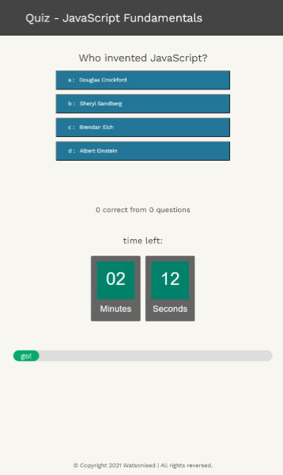
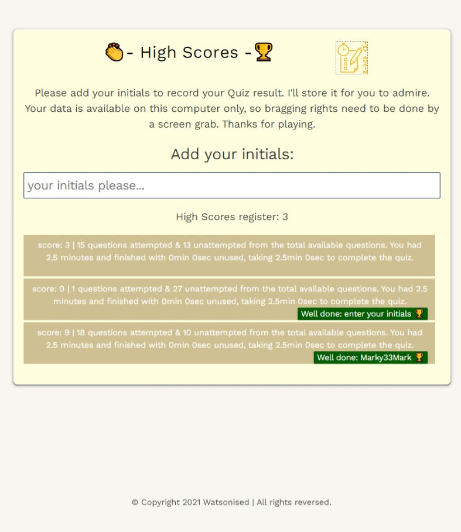

# USYD-FSF Week 4 Project
## JavaScript: Code Quiz - Web API

### Table of Contents  
  
   1. [Project Description](#1-description)
   2. [Application Features](#2-features)
   3. [Installation](#3-installation)
   4. [Usage](#4-usage)
   5. [Credits](#5-credits)
   6. [License](#6-license)
   7. [Repository Status](#7-github-repo-status)
   8. [Contribute](#8-how-to-contribute)
   9. [Tests](#9-tests)
   10. [Checklist](#10-checklist)

---
### 1. Description  
**What is this project?**  
* Provides a user interface for hosting questions against the clock with time penalty for incorrect questions.

**Why this project?**  
* Create an application to test your knowledge on JavaScript fundamentals.

**What problem does this project solve?**  
* Provides a fun environment to host quiz questions against a clock.  

**Lessons learnt?**  
* There was a lot for me to learn here and put into practise to create the final product.  I had a lot of functionality issues switching pages after the end of the quiz to go to the highscore page as I was unfamiliar with location.assign()  and location.replace().  A lot of time would have been saved if I'd discovered this earlier as the high scores page was glitching with window.open() method if a user returns to the quiz page without entering their intials.

* With more time, I would refine the code as you will see I kept tacking on here and there as problems were found.

* I had fun modding the progress bar as a countdown and then turning it into a progress bar.  With a little bit of mathematics it was able to be implemented without too much hassle.
* The countdown was a steep learning curve for me as I needed to modify it to just show minutes and seconds and then later grab data from it.  Would refine the code in a later update.

---
### 2. Features  
Client requested features as implemented:  
- quiz that is against the clock;
- facility to store players high scores in the local storage; 
- key game data is also transferred over with the high score and stored in the local memory; and
- well presented quiz that includes a highly visible timer with a progress bar.

#### The webpage

 

 

---
### 3. Installation  
You can download the source code from [my Github repository](https://github.com/Mark33Mark/code-quiz_webAPI) and open the index.html file to review the website inside your selected web browser.  
Alternatively, the webpage has also been hosted via [URL: quiz.watsonised.com](https://quiz.watsonised.com)

---
### 4. Usage  
The code is available from [my Github repository](https://github.com/Mark33Mark/code-quiz_webAPI) with all assets created for the project.  
Once you've downloaded, you can modify the code as you need.

---
### 5. Credits  
I've referenced [W3 Schools website](https://www.w3schools.com) where I've used their information.
I referenced the following website and code for the quiz:
https://www.sitepoint.com/simple-javascript-quiz/
Whilst useful I only really utilised their code for setting up question cards as it was more efficient than the method I was thinking of doing.
For the high scores, I utilised the code from our course for the todo list.  It's appearance might look familiar!

---
### 6. License  
 The works in this repository are subject to:  

---
### 7. Github repo status  

---
### 8. How to Contribute
 If you would like to contribute, please comply with the Contributor Covenant Code of Conduct:  

---
### 9. Tests  
- Tested only on desktop computer, which included looking at it in the browser's developer tool's mobile phone emulator.  At this stage the app is not displaying correctly on mobile devices.

---
### 10. Checklist  
 All actions not checked are still to be completed:
  * [x]  Build a timed coding quiz with multiple choice questions.
  * [x]  The quiz is to have a clean, polished and responsive user interface.
  * [x]  The quiz is on JavaScript fundamental and stores high scores to gauge progress compared to peers.
  * [x]  When taking the quiz, the use click a start button and a timer starts whilst being presented with a question.
  * [x]  When a question is answered incorrectly, time is subtracted from the clock.
  * [x]  When all questions are answere or the timer reaches 0, then the game is over.
  * [x]  When the game is over, the quizzer can save their intials / name with their score.
  * [x]  The application resembles the mock-up functionality provided in the homework instructions.
  * [x]  Deployed at live URL, [website](https://quiz.watsonised.com) 
  * [x]  Application loads with no errors when inspected with Chrome DevTools.
  * [x]  Github repository contains application code [Github location](https://github.com/Mark33Mark/code-quiz_webAPI)
  * [x]  Repository has a unique name; follows best practice for file structure; and naming conventions.
  * [x]  Repsository follows best practices for class/id naming conventions, indentation, quality comments, etc.
  * [x]  Repository contains multiple descriptive commit messages.
  * [x]  Repository contains a README file with description, screenshot and link to deployed application.
---

- [Back to the top](#usyd-fsf-week-4-project)